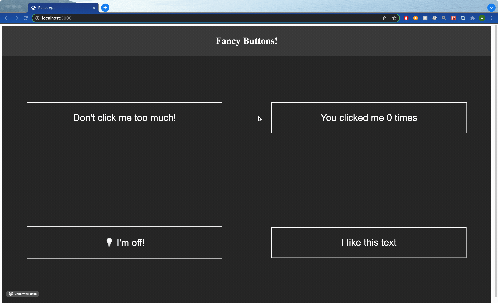

# Getting Started with Fancy Buttons

Simple app for practice programming with components and state in React.

This project was bootstrapped with [Create React App](https://github.com/facebook/create-react-app).

## Available Scripts

In the project directory, you can run: 

### `npm start`

Runs the app in the development mode.\
Open [http://localhost:3000](http://localhost:3000) to view it in the browser.

The page will reload if you make edits.\
You will also see any lint errors in the console.

## Project Features

The web application has 4 buttons that allow the user to interact and change the state of each button.

1. **"Angry" Button**

2. **Counter Button**

3. **Text Repeating Button**

4. **Light Switch Button** - also changes the theme between "light" and "dark"

